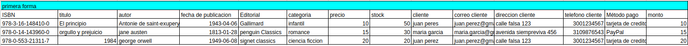
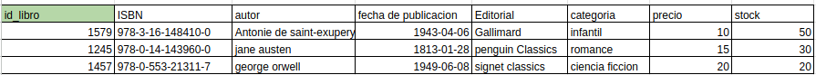
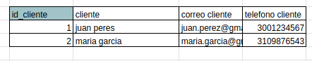
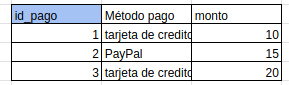
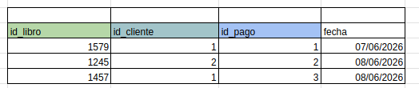
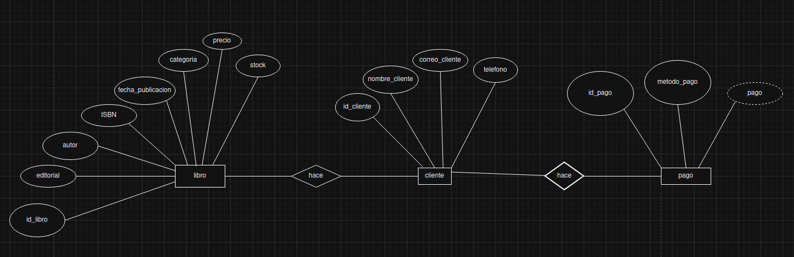
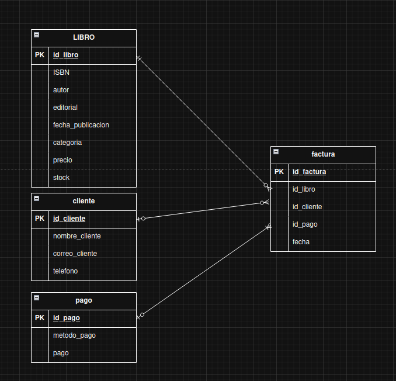

# Examen de gestion de base de datos BD.

Este apartado esta diseñado para poder brindar un mejor control sobre todos los datos que se obtienen por cada libro que se vende y se registra al ingresar a la tienda.
---

# REORGANIZACION
```
Se reorganizan los datos en tablas para poder determinar los campos en que se trabajan, en este cso se trabajan mas sobre los datos de los distintos libros, los diferentes clientes rgistrados que hicieron su compra en la tienda, tambien se registra el metodo de pago.
```

### FORMA NUMERO UNO DE ORGANIZARL LOS DATOS.



----
----
### RORMA NUMERO DOS DE ORTGANIZAR LOS DATOS.

libros:
- registramos todos los campos que necesitaremos principalmente par arecopilar la informacion sobre el libro.

----


cliente:
- En este apartado registramos los campos mas relevantes para recopilar la informacion necesaria sobre el cliente y asi hacerles los pedidos.

----

pago:

- Registramos los campos para tener conocimiento sonbre la forma de pago de el cliente.

----
fatura:
- campo donde le entregamos una factura sobre el pedido o compra que realizo en la tienda.


---

# diagrama E-R

- En este apartado realizamos un diagrama agregandole los campos que se tomaran para registralo en la base de datos.


----

# diagrama UML E-R
- Realizamos un diagrama relacional para poder tener la base mas clara, y asi poder armar de una mejor manera las tablas en SQL, evitando confuciones o perdidas de sintaxis.



# tecnologias y ehharmientas utilizadas:
- 
    * hojas de calculo excel
    * draw.io
    * Visual Studio Code
    * github (para el repositorio.)

# Autor
- 
    Brando Estiben Ixen Teleguario
    ixenbrandonestiben@gmail.com
